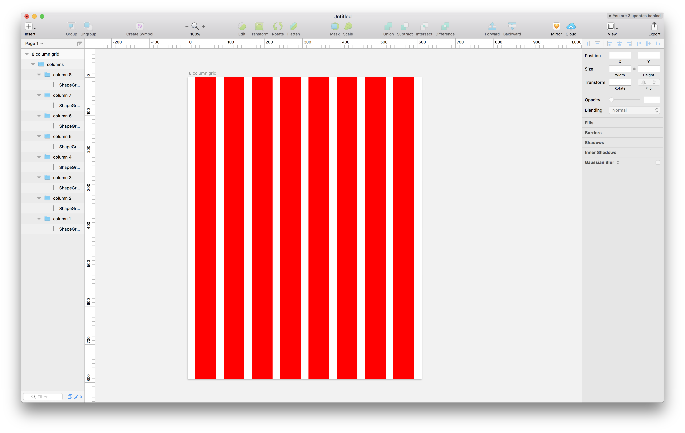

# Sketch Column Grid Generator Plugin
A sketch plugin for generating column grids built with [react-sketchapp](https://github.com/airbnb/react-sketchapp) and inspired by [grid-calculator](http://gridcalculator.dk/).

## How to use
1. Make sure you have [Sketch](http://sketchapp.com) version 43+ installed
2. Make sure you have a recent [npm](https://nodejs.org/en/download/)
3. Open a new Sketch file, then in a terminal:
    1. `git clone https://github.com/endswithak/sketch-column-grid-generator-plugin.git`
    2. `cd sketch-column-grid-generator-plugin`
    3. Edit `./src/config.js` to match your grid requirements
    4. `npm run render`

